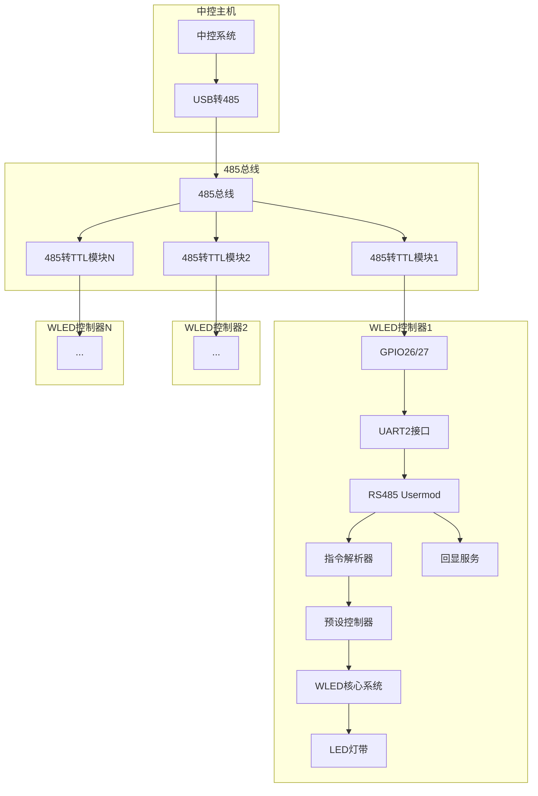
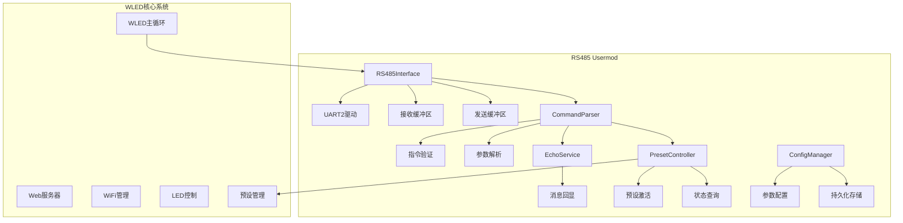

# 设计文档

## 概述

本设计为WLED项目添加基于RS485串口的文本指令控制功能。该功能将作为WLED usermod实现，使用ESP32的UART2接口（GPIO26/27）与485转TTL模块通信。设计采用分阶段实现策略：首先实现回显功能验证硬件连接，然后扩展到完整的指令解析和WLED预设控制。

该设计确保与现有WLED功能完全兼容，不影响Web界面、WiFi连接或其他API接口的正常工作。通过文本协议简化调试和使用，支持中控主机通过485总线控制多个灯光控制器。

## 架构

### 系统架构图



### 软件架构



## 组件和接口

### RS485Interface组件

**职责**: 管理UART2硬件接口，处理485通信的底层细节

**接口**:
```cpp
class RS485Interface {
public:
    bool initialize(int rxPin, int txPin, uint32_t baudRate);
    void loop();
    bool sendMessage(const String& message);
    bool hasMessage();
    String receiveMessage();
    void setConfig(const RS485Config& config);
    RS485Stats getStats();
    
private:
    HardwareSerial* serial;
    CircularBuffer<char> rxBuffer;
    CircularBuffer<char> txBuffer;
    RS485Config config;
    RS485Stats stats;
};
```

**配置结构**:
```cpp
struct RS485Config {
    bool enabled = false;
    uint32_t baudRate = 9600;
    int rxPin = 26;
    int txPin = 27;
    size_t bufferSize = 512;
    uint32_t timeout = 1000;
};
```

### CommandParser组件

**职责**: 解析接收到的文本指令，验证格式和参数

**接口**:
```cpp
class CommandParser {
public:
    ParseResult parseCommand(const String& input);
    String getErrorMessage(ParseError error);
    
private:
    bool validateCommand(const String& cmd);
    CommandType getCommandType(const String& cmd);
    std::vector<String> extractParameters(const String& cmd);
};

enum class CommandType {
    ECHO,
    PRESET_SET,
    PRESET_GET,
    STATUS_GET,
    INVALID
};

struct ParseResult {
    bool success;
    CommandType type;
    std::vector<String> parameters;
    ParseError error;
};
```

**支持的指令格式**:
- `ECHO <message>` - 回显消息
- `PRESET SET <id>` - 激活指定预设
- `PRESET GET` - 获取当前预设信息
- `STATUS` - 获取系统状态

### EchoService组件

**职责**: 实现回显功能，用于验证硬件连接

**接口**:
```cpp
class EchoService {
public:
    String processEcho(const String& message);
    void setEnabled(bool enabled);
    bool isEnabled() const;
    
private:
    bool enabled = true;
};
```

### PresetController组件

**职责**: 控制WLED预设的激活和查询

**接口**:
```cpp
class PresetController {
public:
    bool activatePreset(int presetId);
    int getCurrentPreset();
    String getPresetName(int presetId);
    bool isValidPreset(int presetId);
    String getPresetList();
    
private:
    bool callWLEDAPI(const String& jsonCommand);
    String queryWLEDState();
};
```

### ConfigManager组件

**职责**: 管理485功能的配置参数和持久化存储

**接口**:
```cpp
class ConfigManager {
public:
    void loadConfig();
    void saveConfig();
    RS485Config& getConfig();
    void setConfig(const RS485Config& config);
    void addToInfo(JsonObject& root);
    bool readFromConfig(JsonObject& root);
    
private:
    RS485Config config;
    static const char* CONFIG_FILE;
};
```

## 数据模型

### 配置数据模型

```cpp
struct RS485Config {
    bool enabled;           // 功能启用状态
    uint32_t baudRate;      // 波特率 (9600, 19200, 38400, 57600)
    int rxPin;              // 接收引脚 (默认26)
    int txPin;              // 发送引脚 (默认27)
    size_t bufferSize;      // 缓冲区大小 (默认512字节)
    uint32_t timeout;       // 通信超时 (毫秒)
    bool echoEnabled;       // 回显功能启用状态
    bool debugMode;         // 调试模式
};
```

### 统计数据模型

```cpp
struct RS485Stats {
    uint32_t messagesReceived;    // 接收消息计数
    uint32_t messagesSent;        // 发送消息计数
    uint32_t parseErrors;         // 解析错误计数
    uint32_t bufferOverflows;     // 缓冲区溢出计数
    uint32_t timeouts;            // 超时计数
    uint32_t lastActivity;        // 最后活动时间戳
    bool connected;               // 连接状态
};
```

### 指令数据模型

```cpp
struct Command {
    CommandType type;
    String raw;                   // 原始指令字符串
    std::vector<String> params;   // 解析后的参数
    uint32_t timestamp;           // 接收时间戳
};

enum class ParseError {
    NONE,
    INVALID_FORMAT,
    UNKNOWN_COMMAND,
    INVALID_PARAMETERS,
    PARAMETER_OUT_OF_RANGE,
    BUFFER_OVERFLOW
};
```

## 错误处理

### 错误分类和处理策略

**通信错误**:
- UART初始化失败: 记录错误，禁用功能
- 缓冲区溢出: 清空缓冲区，记录统计信息
- 超时错误: 重置连接状态，继续监听

**解析错误**:
- 无效指令格式: 返回格式说明消息
- 参数超出范围: 返回参数范围说明
- 未知指令: 返回支持的指令列表

**系统错误**:
- 内存不足: 减少缓冲区大小，记录警告
- WLED API调用失败: 返回具体错误信息
- 配置文件损坏: 使用默认配置，记录错误

### 错误响应格式

```
ERROR: <错误类型> - <错误描述>
USAGE: <正确用法说明>
```

示例:
```
ERROR: INVALID_PRESET - Preset 99 does not exist
USAGE: PRESET SET <1-16>
```

## 测试策略

### 双重测试方法

**单元测试**: 验证具体示例、边界情况和错误条件
- 测试特定的指令解析场景
- 验证配置参数边界值
- 测试错误处理路径
- 验证UART初始化和配置

**属性测试**: 验证跨所有输入的通用属性
- 最少100次迭代的随机化测试
- 每个测试引用对应的设计属性
- 标签格式: **Feature: wled-485-control, Property {number}: {property_text}**

### 测试库选择

使用Arduino单元测试框架进行单元测试，结合自定义属性测试实现进行属性验证。由于Arduino环境限制，将实现简化的属性测试框架来支持随机输入生成和属性验证。

### 集成测试策略

- 硬件在环测试: 使用真实485硬件验证通信
- WLED集成测试: 验证与WLED核心系统的交互
- 性能测试: 验证在高负载下的稳定性
- 兼容性测试: 确保不影响现有WLED功能

## 正确性属性

*属性是一个特征或行为，应该在系统的所有有效执行中保持为真——本质上是关于系统应该做什么的正式声明。属性作为人类可读规范和机器可验证正确性保证之间的桥梁。*

### 属性1: 数据传输完整性
*对于任何* 通过RS485接口发送或接收的数据，数据应该完整地存储在相应的缓冲区中，不发生丢失或损坏
**验证需求: Requirements 1.4, 1.5**

### 属性2: 回显恒等性
*对于任何* 输入到回显服务的文本消息（包括特殊字符和换行符），输出消息应该与输入消息完全相同
**验证需求: Requirements 2.1, 2.2**

### 属性3: 消息处理顺序性
*对于任何* 连续接收的消息序列，回显服务应该按照接收顺序依次处理并回复每条消息
**验证需求: Requirements 2.4**

### 属性4: 指令解析正确性
*对于任何* 有效格式的文本指令，指令解析器应该正确提取命令类型和参数，并将结果传递给相应的控制器
**验证需求: Requirements 3.1, 3.4**

### 属性5: 指令解析错误处理
*对于任何* 无效格式或参数超出范围的指令，指令解析器应该返回描述性的错误消息而不是崩溃或产生未定义行为
**验证需求: Requirements 3.2, 3.3**

### 属性6: 特殊字符处理
*对于任何* 包含转义字符或特殊字符的指令，指令解析器应该正确处理这些字符而不产生解析错误
**验证需求: Requirements 3.5**

### 属性7: 预设控制成功响应
*对于任何* 有效的预设ID，预设控制器应该成功激活对应的WLED预设并返回包含预设编号和名称的确认消息
**验证需求: Requirements 4.1, 4.3**

### 属性8: 预设控制错误响应
*对于任何* 无效的预设ID或激活失败的情况，预设控制器应该返回详细的错误信息而不是静默失败
**验证需求: Requirements 4.2, 4.4**

### 属性9: 预设状态查询准确性
*对于任何* 预设状态查询请求，预设控制器应该返回当前激活预设的准确信息
**验证需求: Requirements 4.5**

### 属性10: 配置管理往返一致性
*对于任何* 有效的配置参数，保存然后加载配置应该产生与原始配置等价的结果
**验证需求: Requirements 6.3**

### 属性11: 配置验证和回退
*对于任何* 无效的配置参数，系统应该使用默认配置并提供警告信息，而不是使用无效配置
**验证需求: Requirements 6.5**

### 属性12: 波特率配置有效性
*对于任何* 支持的波特率值（9600, 19200, 38400, 57600），系统应该能够成功应用该配置
**验证需求: Requirements 6.2**

### 属性13: 错误日志记录完整性
*对于任何* 通信错误事件，系统应该记录包含错误类型和时间戳的日志条目
**验证需求: Requirements 7.1**

### 属性14: 状态报告准确性
*对于任何* 系统状态查询，系统应该返回准确的485接口连接状态和统计信息
**验证需求: Requirements 7.2**

### 属性15: 诊断信息输出
*对于任何* 启用诊断模式的情况，系统应该输出详细的通信调试信息
**验证需求: Requirements 7.5**
## 错误处理

### 错误分类和处理策略

**通信错误**:
- **UART初始化失败**: 记录错误到系统日志，禁用485功能，使用默认配置继续运行
- **缓冲区溢出**: 清空接收缓冲区，增加溢出计数器，记录溢出事件到统计信息
- **通信超时**: 重置连接状态标志，继续监听新消息，记录超时事件

**解析错误**:
- **无效指令格式**: 返回格式说明消息 `"ERROR: INVALID_FORMAT - Use: COMMAND [PARAMS]"`
- **参数超出范围**: 返回参数范围说明 `"ERROR: PARAMETER_OUT_OF_RANGE - Valid range: X-Y"`
- **未知指令**: 返回支持的指令列表 `"ERROR: UNKNOWN_COMMAND - Supported: ECHO, PRESET, STATUS"`

**系统错误**:
- **内存不足**: 减少缓冲区大小到最小可用值，记录警告到日志
- **WLED API调用失败**: 返回具体API错误信息，保持485功能继续运行
- **配置文件损坏**: 使用默认配置值，记录配置重置事件

### 错误恢复机制

**自动恢复**:
- 缓冲区溢出后自动清空并重新开始接收
- 通信超时后自动重置连接状态
- 解析错误后继续处理下一条消息

**手动恢复**:
- 提供重置统计信息的指令
- 提供重新初始化UART的配置选项
- 提供清空缓冲区的调试指令

## 测试策略

### 双重测试方法

**单元测试**: 验证具体示例、边界情况和错误条件
- 测试特定的指令解析场景（如 "PRESET SET 1"）
- 验证配置参数边界值（波特率范围测试）
- 测试错误处理路径（无效指令、缓冲区溢出）
- 验证UART初始化和配置设置

**属性测试**: 验证跨所有输入的通用属性
- 最少100次迭代的随机化测试
- 每个属性测试引用对应的设计文档属性
- 标签格式: **Feature: wled-485-control, Property {number}: {property_text}**
- 每个正确性属性必须由单个属性测试实现

### 测试库和配置

**Arduino单元测试框架**: 用于具体示例和边界条件测试
- 使用AUnit或ArduinoUnit库进行单元测试
- 测试覆盖所有公共接口和错误路径
- 模拟UART硬件进行隔离测试

**自定义属性测试框架**: 由于Arduino环境限制，实现简化的属性测试
- 随机输入生成器（字符串、数值、配置参数）
- 属性验证断言框架
- 测试结果统计和报告

### 测试配置要求

- 每个属性测试运行最少100次迭代
- 每个测试必须标记对应的设计属性编号
- 使用注释格式: `// Feature: wled-485-control, Property 1: 数据传输完整性`
- 属性测试和单元测试互补，共同提供全面覆盖

### 集成测试策略

**硬件在环测试**:
- 使用真实485转TTL模块验证通信
- 测试不同波特率下的数据传输
- 验证长时间运行的稳定性

**WLED集成测试**:
- 验证与WLED核心系统的API交互
- 测试预设激活和状态查询功能
- 确保不影响现有Web界面和WiFi功能

**性能和负载测试**:
- 高频率消息处理测试
- 大量数据传输测试
- 内存使用和泄漏检测

**兼容性测试**:
- 多个WLED版本兼容性验证
- 不同ESP32开发板兼容性测试
- 与其他usermod的共存测试